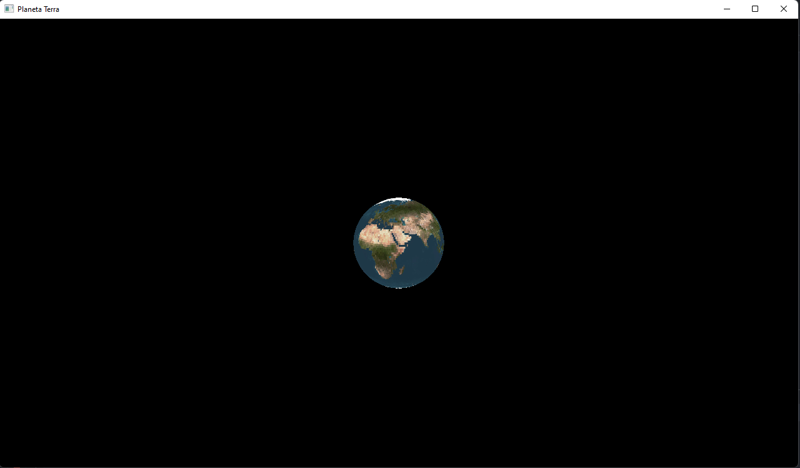

# Planeta Terra
Implementação da textura do planeta terra em uma esfera, que permanece rotacionando no centro da tela

## Como executar
Basta executar esse comando dentro deste diretório:
```
python main.py
```

## Aplicação executando
