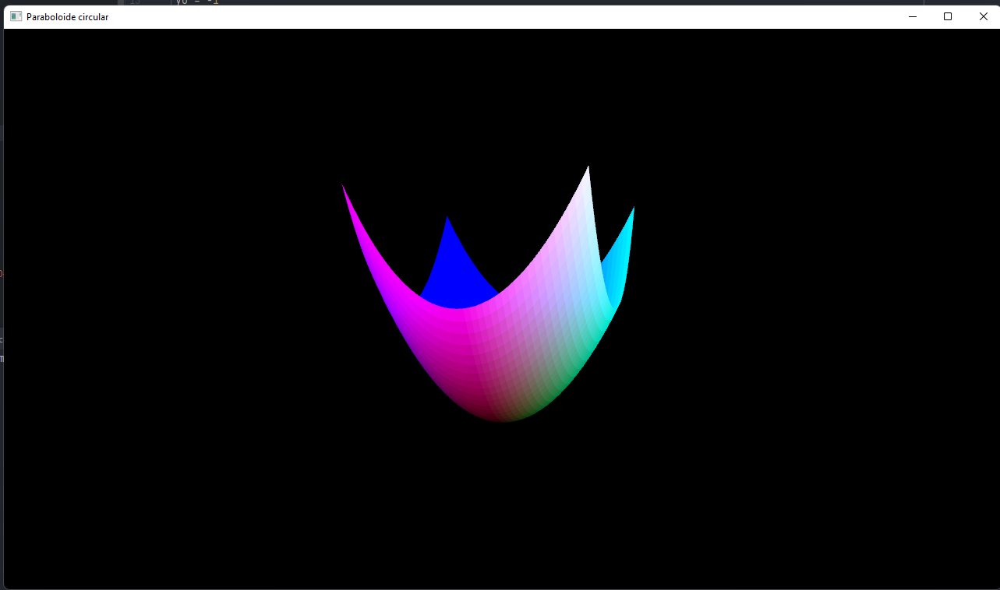
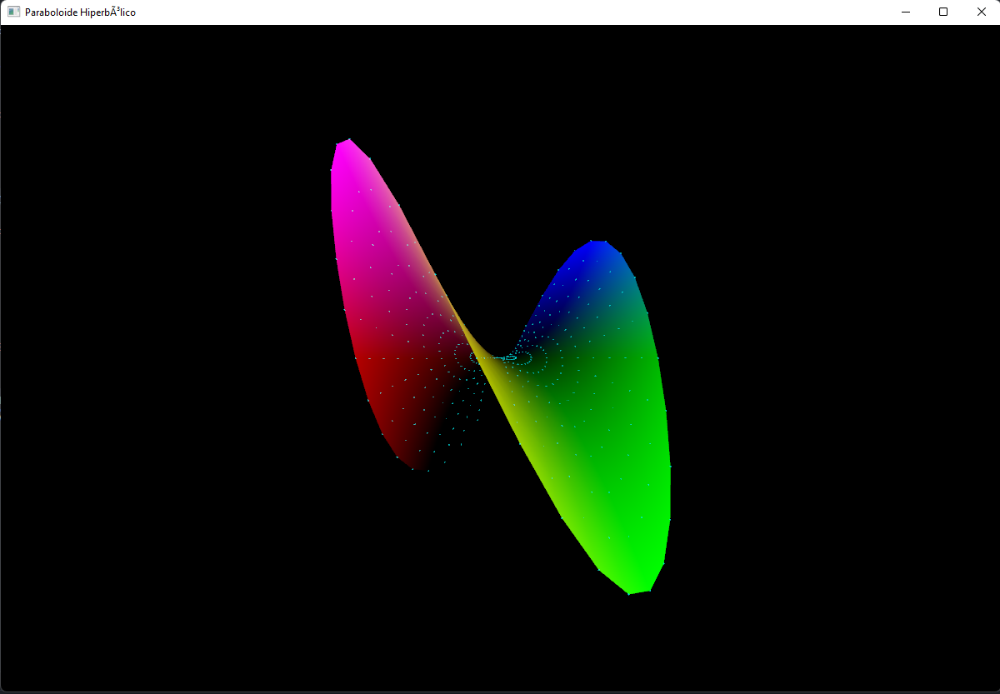

# Paraboloide circular e hiperbólico
Duas implementações:
- Paraboloide circular
- Paraboloide hiperbólico

## Como executar
### Paraboloide circular
Executar este comando na raiz desta pasta
```
python circular.py
```

### Paraboloide hiperbólico
Executar este comando na raiz desta pasta
```
python hiperbolico.py
```

## Aplicação executando
### Paraboloide circular

### Paraboloide hiperbolico
