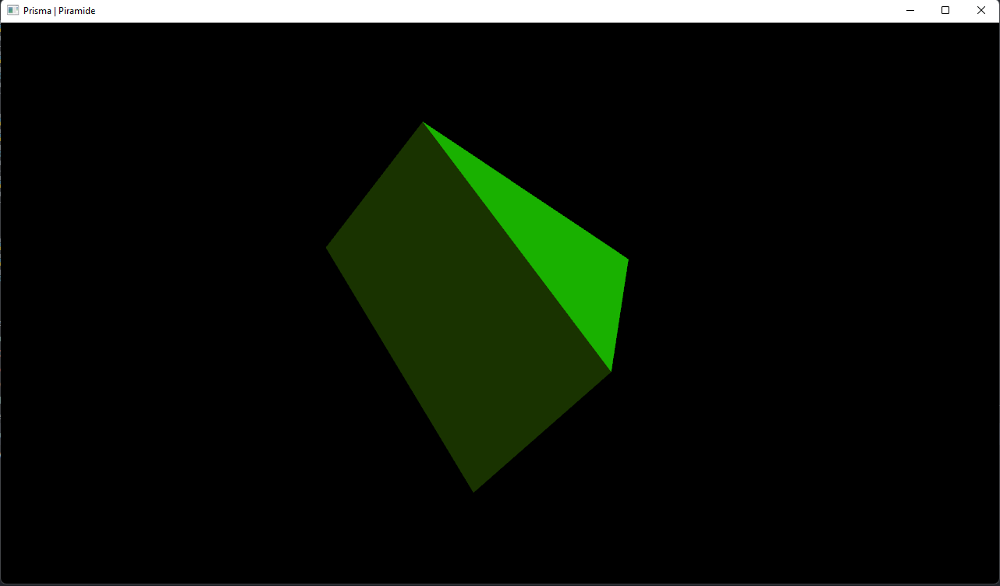

# Iluminação de prisma
Implementação de técnicas de iluminação em um prisma - pirâmide, rotacionando de forma aleatória no centro da tela

## Como executar
Basta executar esse comando dentro deste diretório:
```
python main.py
```

## Aplicação executando
