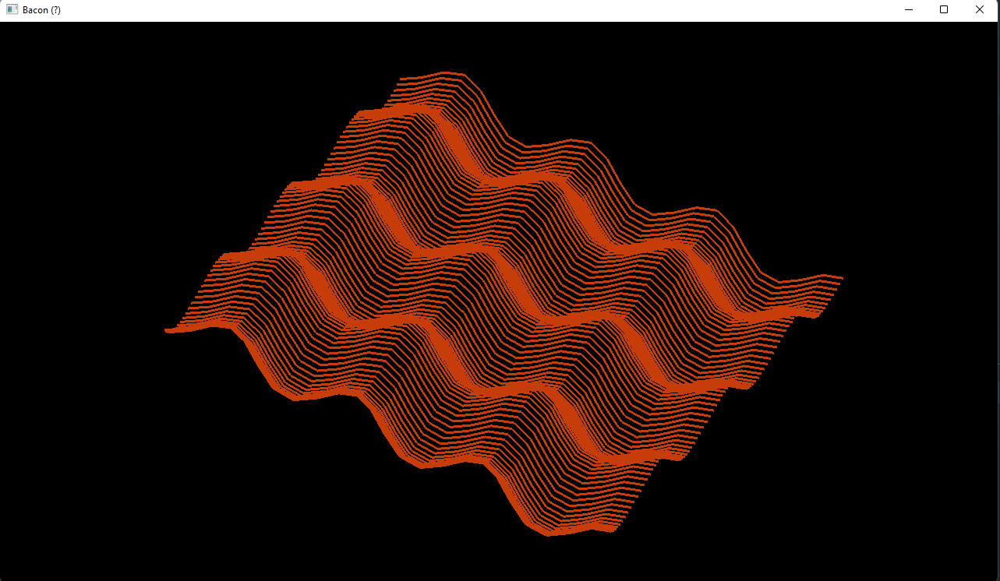

# Bacon giratório
Implementação de ilusão de ótica - Caso esteja com fome, será exibido um pedaço de bacon rotacionando. Caso contrário,
apenas uma malha girando no centro da tela, com iluminação aplicada.

## Como executar
Basta executar esse comando dentro deste diretório:
```
python bacon.py
```

## Aplicação executando
